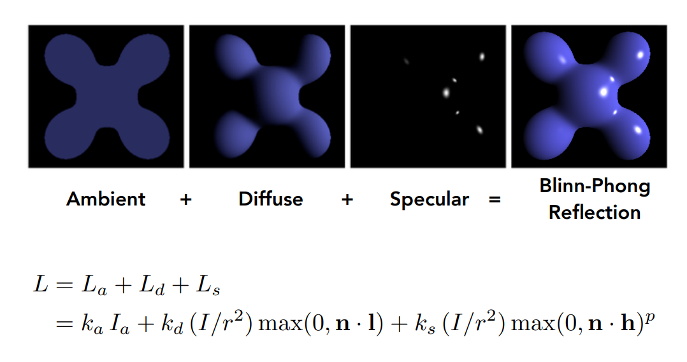
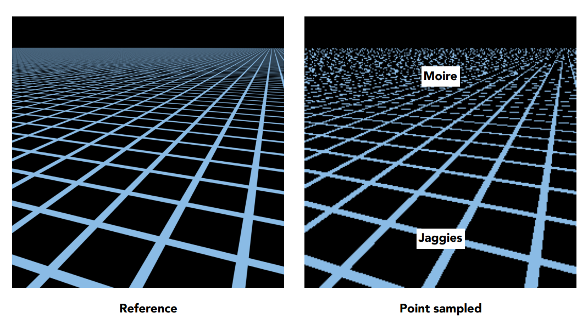

240127

旋转矩阵和透视矩阵

MVP: model view projection （模型 视图 投影）

### 视图变换View（模型视图变换ModelView）

根据相机的位置和角度进行变换，让相机转到**以-Z为方向，Y为上的角度，且相机位置为原点**（默认是右手系）。让其他物体进行相同的变换，让相机中看到的结果不变。以下图为参考：

**平移操作**比较容易，直接写成这个形式：

**旋转操作**会难一点直接考虑g到-Z，t到Y，(g×t)到X会比较困难，但是反过来的计算更加简单（下图的R^-1^如果乘以X（1，0，0，0）、Y（0，1，0，0）、-Z（0，0，-1，0）得到的分别是(g×t)、t、g），对反过来的矩阵求一个逆矩阵就是我们需要的旋转变换矩阵。**旋转矩阵是正交矩阵，因此他的逆就是他的转置**。

### 投影变换Projection

正交投影 透视投影（近大远小）

#### 正交投影Orthographic projection

**简单理解，并非实际做法：**

因为相机是朝向-Z方向，简单的方式是拿掉Z轴（依然要区分物体的前后），然后缩放到[-1,1]*[-1,1]的矩形中（约定俗成的，为了方便后续计算）。

**实际做法：**

一个空间中的长方体，**在X轴的左右lr，在Y轴的下上bt，在Z轴的远近fn，映射到[-1,1]^3^的正则（也叫规范、标准）立方体中**。（注意远的Z轴小，近的Z轴大，也就是近大于远，因为是-Z的方向。OpenGL会使用左手系来让他变成远大于近，但也会有X×Y不等于Z的问题，左右手系各有好坏）

变换过程，**先平移来移动中心到原点，再对三个轴上的尺寸进行缩放**，如下图所示。

#### 透视投影Perspective projection

透视投影将一个四棱锥（frustum）挤压为长方体，然后再用正交投影的方法。

**挤压的过程**：首先我们规定：近平面的每个点不变，远平面每个点的Z不变，远平面的中心点不变（为什么）。任意点(x, y, z)映射到近平面z=-n的点(x', y', z')，那么挤压后的x=x'，y=y'，通过相似三角形知道每个点的X和Y该如何变化。(0>n>z>f)

可知挤压后的点为(nx, ny, ?, z)，不过此时我们只知道x和y如何变化，并不知道z如何变化（z并不是不变的），根据之前的定义近平面点不变，远平面z不变可以用来求出第三行的变化。

240128

对于近平面的点(x, y, n, 1)变化之后等于自身也就是(nx, ny, n^2^, n)，n^2^是与x和y无关的数，所以可以得出上图所示的式子An+B=n^2^。又因为远平面中心点(0, 0, f, 1)在挤压后位置不变，得到上图的第二个式子Af+B=f^2^。

最终解出AB

第三行也就是Az+B = (n+f)*z-nf   0>n>z>f

z'-z = k     f^2^-f>k>n^2^-n>0    z'>z   可知挤压后更靠近近平面
$$
透视投影到正交投影的转换M_{p2o} = \begin{pmatrix} n & 0 & 0 & 0 \\ 0 & n & 0 & 0 \\ 0 & 0 & n+f & -nf \\ 0 & 0 & 1 & 0 \end{pmatrix}
$$

#### FoV Field of View

竖直方向上的fovY为近平面上下中点与相机位置的夹角，也就是2arctan(t/|n|)，宽高比aspect=r/t

### 视口变换Viewport

将之前得到的[-1,1]^3^的立方体进行缩放，符合屏幕的分辨率

### 光栅化Rasterization

解决将三角形转换为像素应当如何转换的问题。

最简单的方法：采样Sampling，判断像素中心在三角形内。

通过叉积，如果点与三个边的向量同侧就是在内部（都是顺时针或逆时针）

采样点位于边界上的情况，要么不做处理，要么就进行特殊处理，可以自己定义。在OpenGL中规定了左上在内，右下在外。

优化方案，不用检查屏幕中的每个像素，只需要检查上图蓝色区域中的像素，称为包围盒（Bounding Box）。判断x和y的最大最小值确定蓝色区域。

其他的优化方案：计算每一行的左右端点，保证不会计算多余的点，适用于细长的、斜对角的三角形

240202

### 走样Aliasing

采样可能存在问题：锯齿、摩尔纹、车轮效应。本质上是因为信号变换太快了。

解决方法：在采样之前进行模糊（滤波）

要先模糊再采样

同样的采样方法去采两个截然不同的函数，可能得到相同的结果

频域FrequencyDomain

240217

240218

Convolution in the spatial domain is equal to multiplication in the frequency domain, and vice versa

实域中的卷积 = 频域中的乘积

采样 = 重复频率内容

走样 = 混合的频率内容

这段听不太懂

### 反走样（抗锯齿）

可以通过增加采样率，或者使用反走样的算法（比如采样前过滤掉高频率），以减少走样。

#### MSAA

在一个像素内使用多个采样点（比如4*4），对颜色取平均值。

缺点在于开销会很大，如果一个像素内有非常多的采样点，计算量指数级增加。

#### FXAA (Fast Approximate AA)

不增加采样，对采样后的图像进行后期处理，分析边界，将边界换成没有锯齿的边界。

#### TAA (Temporal AA)

根据上一帧进行分析，复用上一帧的结果。

### 超分辨率/超采样

#### DLSS (Deep Learning Super Sampling)

利用深度学习对低分辨率的图像猜出更高的分辨率。

240224

### 深度缓冲Z-buffering

处理前后遮挡关系

**画家算法**：从后向前一步步画，这样前面的就会覆盖后面的。对每个三角形的深度进行排序，但无法处理所有情况，如下图。一般不用。

**深度缓冲算法**：对每个采样点（像素）计算离相机最近的点并记录。（为简化计算，下面会默认z是正数，z越小离相机越近）。这样需要两个缓冲区，帧缓冲（frame_buffer）记录每个像素的颜色，深度缓冲（depth_buffer）记录每个像素的深度。（深度缓冲不能处理半透明的物体）

### 着色Shading

将材质应用于物体。

一个简单的着色模型：布林-冯模型 Blinn-Phong Reflectance Model

着色的过程关注于这个点的光反射，不会计算它在其他面上造成的阴影。（Shading is local / shading != shadow）

计算使用的条件：

- 观察者（相机）方向向量 v
- 光线方向向量 l
- 表面的法线向量 n
- 表面的各种参数

### 布林-冯模型 Blinn-Phong Reflectance Model

布林-冯模型主要考虑以下几项：漫反射、高光、环境光

#### 漫反射

1、光的漫反射均匀地反射到每个方向：

2、光与表面法线的夹角影响单位面积上光的强度：

3、光的强度随距离的衰减：

结合上述三点得到该点漫反射的光强度公式 $L_d=k_d(I/r^2) \cdot max(0,n \cdot l)$  （kd代表漫反射率，是一个简化了的计算，不完全反映物理规律；n和l是单位向量，点乘的结果就是cos(theta)，如果点乘小于等于0那就是光在背面不予考虑）。该点漫反射的光强度与相机位置（v）无关。

#### 高光

高光取决于观察方向和镜面反射方向，方向越接近越强。

高光的计算根据l和v的半程向量与法线n的夹角决定。半程向量指两向量的角平分线处的向量，如果两个向量都是单位向量则可以直接两者相加再单位化，如下图h的计算。

高光的计算公式：$L_s=k_s(I/r^2)max(0,n\cdot h)^p$  其中ks是镜面反射系数。这里不考虑l*n因为布林-冯模型简化了这个计算。

使用半程向量是因为他好计算，反射方向较难计算，用反射方向和v的夹角也能计算。

不能直接使用夹角余弦，因为余弦运算的容忍度太高，导致高光的范围太大。我们希望高光聚集在很小的点上，所以给他一个指数p。一般p在100-200之间。

#### 环境光照

环境光为了简化计算，会假设为一个常数，和其他没有任何关系。$L_a = k_a I_a$ Ia是环境光强度，是固定值。

#### 结果

全部加起来就得到了最后的结果。$L = L_a + L_d + L_s$

### 着色频率

对同样的模型使用不同的着色。第一个对每个面，第二个对每个顶点，第三个对每个像素。

Flat shading：每个面上法线方向固定，对光滑表面的效果不好。

Gouraud shading： 计算三角面的三个顶点的法线，根据三个顶点的颜色对三角形内部做插值。

Phong shading：根据三个顶点的法线通过插值得到面内每个点的法线，计算每个点的着色。

如何求顶点的法线：对相邻的每个面的法线求平均（可以加权）

如何根据顶点法线如何插值面上每个点的法线：根据重心坐标

### 图形管线（实时渲染管线） Graphics(Real-time Rendering) Pipeline

MVP -- 顶点处理

采样 -- 光栅化

深度缓冲 -- 像素（片元）处理

着色 -- 顶点处理（可以为顶点设置他的计算方式）、像素处理

纹理映射 -- 顶点处理、像素处理

### Shader Program

能在硬件上运行的语言 比如opengl

每个顶点（或像素）上都会应用的计算

分为顶点着色器、像素（片段）着色器

### 纹理

三维物理的表面是二维的，将表面和一个二维图片进行映射。三角形的每个顶点映射到图片的uv坐标系。

tiled texture 上下左右可无缝重复的图像

### 重心坐标 Barycentric Coordinates

知道顶点的属性，希望知道三角形内部每个点的值，平滑过渡，所以需要重心坐标。

在平面上，将任何一个点的坐标可以通过三角形三个点的坐标来表示，如下图。如果alpha,beta,gamma都是非负的，那么点是在三角形内的。将alpha, beta, gamma组成的坐标称为重心坐标。

三角形内的点alpha, beta, gamma可以通过面积的比值计算，将点与三个顶点相连，划分出三个三角形，AA代表顶点A对面的三角形的面积（与A不相邻）

对于形心的重心坐标，因为划分的三个三角形面积一样，所以坐标都是1/3

可以通过计算得到重心坐标的公式：

这样我们就可以通过重心坐标来做插值了。但是需要注意不能用投影后的坐标来求重心坐标（重心坐标经过投影后会发生变化），需要通过逆运算求出原本的坐标再求重心坐标。

### 纹理映射

#### 纹理过小

我们可以通过屏幕坐标得到纹理的uv坐标，但是如果屏幕分辨率高纹理分辨率低，那么简单的映射会效果不好。纹理上的像素可以称为纹素（texel）

#### 双线性插值 Bilinear

对于一个点，取离他最近的四个像素，进行线性插值（lerp = linear interpolation）。

先对上下的点计算一次线性插值，再对这个点做一次线性插值。（水平插值，竖直插值）

Bicubic运算用周围的16个像素来插值，开销更大效果更好。

#### 纹理过大

如果纹理太大，反而会引起更严重的问题。远处出现摩尔纹，近处出现锯齿。

因为在近处一个像素覆盖了很小的区域，在远处一个像素覆盖了很大的一片区域，用像素中心采样就有问题。

这里也可以像之前一样用MSAA，但是开销很大。

思路：避免采样，立刻知道一个区域的平均值。方法：mipmap

#### Mipmap

能做范围查询，特点：快、不准、只能做正方形的范围查询

mipmap每一层分辨率都是上一层分辨率的一半。

在渲染之前提前处理，生成每一层。每一层的尺寸是上一层的1/4，所以总共多了1/3的存储量。

如何知道一个像素覆盖了多大的区域：一个点到上面一个点，到右边一个点，投影到纹理空间上的距离，取最大的距离L，取一个以L为边长的正方形作为近似区域。

这个正方形区域在第几层会变成一个像素的大小：$D=log_2L$，将D作为MipMap的层级

但是计算得到的D在图像上是明显不连续的，最好再做插值。

#### 三线性插值 Trilinear

在双线性插值的基础上对mipmap做插值（根据D）。

插值后的效果：

三线性插值也存在问题，Mipmap在远处会完全糊掉，变成过分模糊（Overblur）。

#### 各向异性过滤 Anisotropic Filtering

可以部分解决三线性插值的问题。

考虑水平和竖直方向上的压缩不均匀，这样对应一个矩形的区域而不一定是一个正方形的区域。每个矩形的长或宽是缩一半，总的额外存储开销是原本的3倍。

各项异性过滤能对长条形的区域更好地处理，不用限制在正方形。但是对于斜着的区域没法处理。解决方法如：EWA过滤。

EWA过滤将一个任意形状的区域拆成多个圆形区域，每次查询一个圆形，多次查询得到这个区域。多次查询产生额外开销。

各项异性过滤多少倍不影响计算，只会稍微影响显存，多少倍就是会有多少层，最多额外存储的开销是原本的3倍。各向异性的2x：

